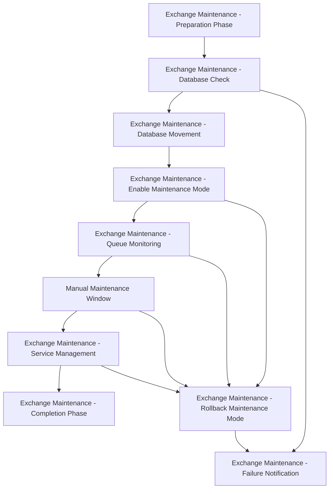

# Exchange Maintenance AAP Workflow Setup Guide

This guide provides step-by-step instructions for setting up the Exchange Server Maintenance Workflow in Ansible Automation Platform (AAP).

## Table of Contents

1. [Prerequisites](#prerequisites)
2. [Import Project](#import-project)
3. [Create Job Templates](#create-job-templates)
4. [Create Workflow Template](#create-workflow-template)
5. [Configure Survey](#configure-survey)
6. [Testing and Validation](#testing-and-validation)
7. [Usage Instructions](#usage-instructions)
8. [Troubleshooting](#troubleshooting)

## Prerequisites

### AAP Requirements
- Ansible Automation Platform 2.1 or higher
- Access to AAP Controller with workflow creation permissions
- Execution environment with Windows support
- Valid Windows domain credentials configured

### Infrastructure Requirements
- Exchange Server 2016, 2019, or Subscription Edition
- Windows PowerShell 5.1 or higher on Exchange servers
- Network connectivity from AAP to Exchange servers
- Appropriate firewall rules for PowerShell remoting

### Permissions Required
- Exchange Organization Management role
- Local Administrator rights on Exchange servers
- Domain account with sufficient privileges for service management

## Import Project

### Step 1: Create SCM Project

1. Navigate to **Resources → Projects** in AAP Controller
2. Click **Add** to create a new project
3. Configure the following settings:

```yaml
Name: Exchange Maintenance
Description: Exchange Server maintenance automation with workflow support
Organization: Default  # Adjust for your organization
SCM Type: Git
SCM URL: [Your Git Repository URL]
SCM Branch/Tag/Commit: main
Update Revision on Launch: Yes
```

### Step 2: Sync Project

1. Save the project configuration
2. Click **Sync** to download the project files
3. Verify all files are present in the project directory

## Create Job Templates

### Step 3: Import Job Templates

You can import job templates using one of these methods:

#### Method A: Using AAP Controller GUI

Create each job template manually using the specifications in `aap/job_templates.yml`. For each template:

1. Navigate to **Resources → Templates**
2. Click **Add → Job Template**
3. Configure using the parameters from the YAML file

#### Method B: Using Ansible Playbook

```bash
# Import job templates programmatically
ansible-playbook -i localhost, aap/import-job-templates.yml \
  -e tower_host=your-aap-controller.domain.com \
  -e tower_username=admin \
  -e tower_password=your-password
```

### Step 4: Configure Credentials

Ensure you have the following credentials configured:

1. **Windows Domain Admin Credential**
   - Type: Machine
   - Username: DOMAIN\username
   - Password: [Password]

2. **Exchange PowerShell Credential** (if different)
   - Type: Machine
   - Username: Exchange service account
   - Password: [Password]

### Step 5: Configure Inventories

Create inventories for your Exchange environments:

1. **Exchange Servers Inventory**
   ```ini
   [exchange_servers]
   your-exchange-server-01.domain.com
   your-exchange-server-02.domain.com
   
   [exchange_production]
   your-prod-exchange.domain.com
   
   [exchange_preproduction]  
   your-ppd-exchange.domain.com
   ```

## Create Workflow Template

### Step 6: Create Workflow Job Template

1. Navigate to **Resources → Templates**
2. Click **Add → Workflow Job Template**
3. Configure basic settings:

```yaml
Name: Exchange Server Maintenance Workflow
Description: Comprehensive Exchange Server maintenance workflow with safety checks and approvals
Organization: Default
Inventory: Exchange Servers
```

### Step 7: Configure Workflow Visualizer

1. Click **Visualizer** tab
2. Add workflow nodes in this order:



3. Configure success/failure paths according to `aap/workflow_job_template.yml`

### Step 8: Link Job Templates

For each workflow node:

1. Click the **+** button to add a node
2. Select the appropriate job template
3. Configure **On Success** and **On Failure** connections
4. Set convergence rules where needed

## Configure Survey

### Step 9: Enable Survey

1. In the workflow template, click **Survey** tab
2. Enable **Survey Enabled**
3. Add survey questions based on `aap/workflow_survey.yml`:

#### Required Survey Questions:

```yaml
Target Database:
- Type: Multiple Choice
- Choices: PREPROD-MB01, EXAMPLE-MB01
- Variable: target_database
- Required: Yes

Environment Type:
- Type: Multiple Choice  
- Choices: preproduction, production
- Variable: environment_type
- Required: Yes

Maintenance Window Duration:
- Type: Integer
- Min: 30, Max: 480
- Variable: maintenance_window_duration
- Default: 120

Maintenance Reason:
- Type: Text Area
- Variable: maintenance_reason
- Required: Yes
- Min Length: 10
```

### Step 10: Configure Advanced Survey Options

Add conditional logic and validation rules:

1. **Production Validation**: Recommend change request number for production
2. **Maintenance Window**: Configurable duration and extension options  
3. **Notification Settings**: Configure email notifications

## Testing and Validation

### Step 11: Test Pre-Production Environment

1. Launch workflow with `PREPROD-MB01` database
2. Verify all phases execute correctly
3. Check that maintenance mode is properly entered and exited
4. Validate database movement (if applicable)

### Step 12: Test Failure Scenarios

1. Simulate failures in different phases
2. Verify rollback procedures work correctly  
3. Test notification and escalation workflows
4. Validate error handling and logging

## Usage Instructions

### Launching the Workflow

1. Navigate to **Resources → Templates**
2. Find "Exchange Server Maintenance Workflow"
3. Click **Launch**
4. Complete the survey form:
   - Select target database
   - Choose environment type
   - Set maintenance window duration
   - Provide maintenance reason and change request details

### During Execution

#### Both Pre-Production and Production Workflows
- Automatic execution through all phases
- Manual confirmation required during maintenance window
- Automatic completion and cleanup
- Same safety checks and rollback procedures for both environments

### Monitoring Progress

1. **Job Dashboard**: Monitor overall workflow progress
2. **Individual Jobs**: Review detailed logs for each phase
3. **Notifications**: Email alerts for failures or approvals needed
4. **Inventory Status**: Track which servers are in maintenance mode

## Workflow Phase Details

### 1. Preparation Phase
- Load Exchange PowerShell snap-in
- Clean old maintenance files
- Get server information
- Validate prerequisites

### 2. Database Check  
- Identify active databases on target server
- Determine if database movement is needed
- Check database replication health

### 3. Database Movement
- Move active databases to other DAG members
- Wait for replication completion
- Verify database movement success

### 4. Maintenance Mode
- Set server components to maintenance state
- Suspend cluster node participation
- Disable database copy activation

### 5. Queue Monitoring
- Check transport queues
- Export queue information
- Verify queue drainage

### 6. Manual Maintenance Window
- Structured pause for manual tasks
- Extension options available
- Emergency abort capability

### 7. Service Management
- Check Exchange service status
- Start any stopped services
- Verify service health

### 8. Completion Phase
- Exit maintenance mode
- Resume cluster participation
- Final health verification

## Troubleshooting

### Common Issues

#### 1. PowerShell Connectivity
```powershell
# Test PowerShell remoting
Test-WSMan -ComputerName exchange-server.domain.com
Enter-PSSession -ComputerName exchange-server.domain.com
```

#### 2. Exchange Module Loading
```powershell
# Verify Exchange snap-in
Add-PSSnapin Microsoft.Exchange.Management.PowerShell.SnapIn
Get-ExchangeServer
```

#### 3. Database Movement Failures
- Check DAG health: `Get-DatabaseAvailabilityGroup`
- Verify replication: `Get-MailboxDatabaseCopyStatus`
- Review cluster status: `Get-ClusterNode`

#### 4. Maintenance Mode Issues
```powershell
# Check server component states
Get-ServerComponentState -Identity server-name

# Manual exit from maintenance mode
Set-ServerComponentState server-name -Component ServerWideOffline -State Active -Requester Maintenance
Resume-ClusterNode server-name
Set-MailboxServer server-name -DatabaseCopyActivationDisabledAndMoveNow $false
```

### Emergency Procedures

#### Emergency Rollback
If the workflow fails and manual intervention is needed:

1. **Immediate Actions**:
   ```bash
   # Launch emergency rollback
   ansible-playbook exchange-maintenance-rollback.yml \
     -e target_database=EXAMPLE-MB01 \
     -e emergency_rollback=true
   ```

2. **Manual Verification**:
   - Check Exchange services are running
   - Verify databases are mounted and accessible
   - Test mail flow functionality
   - Review Event Logs for errors

#### Service Recovery
```powershell
# Restart Exchange services
Get-Service MSExchange* | Where-Object {$_.Status -eq 'Stopped'} | Start-Service

# Check service status
Get-Service MSExchange* | Select Name, Status
```

### Support and Escalation

#### Log Collection
- **Ansible Logs**: Available in AAP job output
- **Exchange Logs**: `C:\Program Files\Microsoft\Exchange Server\V15\Logging`
- **Windows Event Logs**: Application and System logs
- **PowerShell Transcripts**: Enabled in the automation

#### Escalation Contacts
Configure your escalation procedures in:
- `playbooks/maintenance-failure.yml`
- Alert integration with your monitoring systems
- PagerDuty, ServiceNow, or other ITSM tools

## Best Practices

### Scheduling Maintenance

1. **Pre-Production First**: Always test in PPD environment
2. **Change Management**: Follow your change control process
3. **Maintenance Windows**: Schedule during low-usage periods
4. **Communication**: Notify stakeholders in advance

### Security Considerations

1. **Credential Management**: Use AAP credential vault
2. **RBAC**: Implement proper role-based access controls
3. **Audit Logging**: Enable comprehensive audit trails
4. **Network Security**: Secure PowerShell remoting channels

### Performance Optimization

1. **Execution Environment**: Use dedicated execution environments
2. **Concurrent Jobs**: Limit concurrent maintenance operations
3. **Resource Allocation**: Ensure adequate AAP resources
4. **Database Replication**: Monitor replication performance

## Advanced Configuration

### Custom Notification Integration

Modify `playbooks/maintenance-failure.yml` to integrate with your systems:

```yaml
# Example: ServiceNow integration
- name: Create ServiceNow incident
  uri:
    url: "https://your-instance.servicenow.com/api/now/table/incident"
    method: POST
    headers:
      Authorization: "Basic {{ servicenow_token }}"
      Content-Type: "application/json"
    body_format: json
    body:
      short_description: "Exchange Maintenance Failure - {{ target_database }}"
      description: "{{ failure_reason }}"
      urgency: "2"
      impact: "2"
```

### Multi-Environment Support

Extend the workflow for additional environments by:

1. Adding new database choices to survey
2. Creating environment-specific inventories
3. Configuring environment-specific variables
4. Implementing environment-specific approval workflows

### Integration with External Systems

- **Monitoring Systems**: SCOM, Nagios, Zabbix integration
- **ITSM Tools**: ServiceNow, Remedy integration  
- **Communication**: Slack, Microsoft Teams notifications
- **Documentation**: Confluence, SharePoint updates

---

## Conclusion

This workflow provides a comprehensive, safe, and auditable approach to Exchange Server maintenance. The multi-phase design with approval gates and rollback capabilities ensures production safety while maintaining operational efficiency.

For additional support or customization requirements, consult your Ansible and Exchange administration teams.

**Version**: 1.0  
**Last Updated**: {{ ansible_date_time.date }}  
**Author**: Exchange Maintenance Automation Team